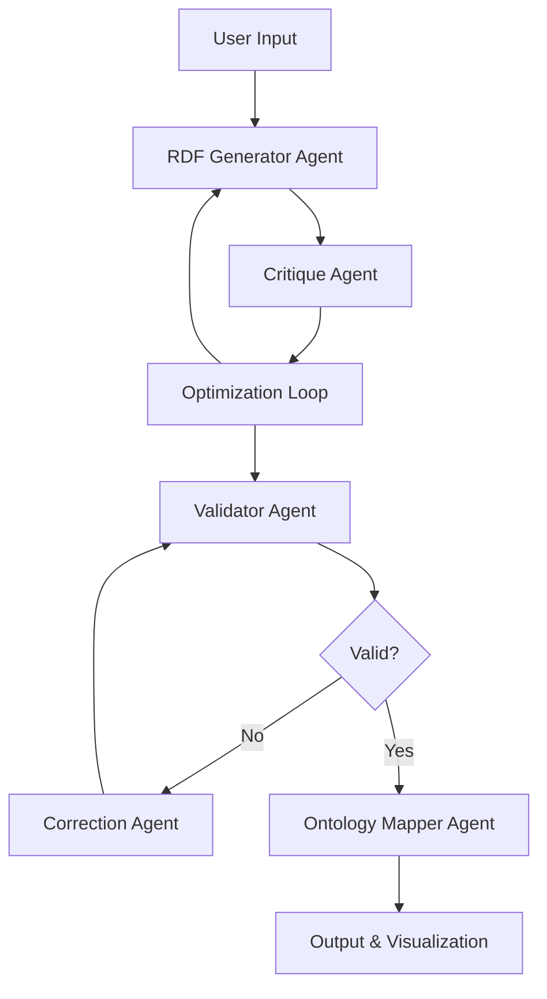

# 🧠 SemAiOn: Agent-Based Semantic Data Generator

**SemAiOn** is an intelligent application that transforms unstructured materials science test data into standardized RDF (Resource Description Framework) and SHACL (Shapes Constraint Language) semantic models. The system uses advanced AI agents to automatically generate, optimize, and validate knowledge graphs specifically tailored for materials science data. Using Agent to re-build my [previous app](https://github.com/teman67/LLM_RDF_SHACL)

[View live website here](https://agent-rdf-shacl-creator-0f2d13e6fb10.herokuapp.com/)

## 🎯 Overview

SemAiOn bridges the gap between raw experimental data and structured semantic knowledge by:

- Converting mechanical test reports into formal ontology structures
- Generating compliant RDF representations of experimental data
- Creating SHACL validation shapes for data quality assurance
- Providing interactive visualization of generated knowledge graphs
- Supporting multiple LLM providers for flexible deployment

## 🚀 Features

### Core Capabilities

- **Multi-Agent Architecture**: Specialized agents for generation, validation, critique, and correction
- **Multiple LLM Support**: OpenAI GPT models, Anthropic Claude, and local Ollama models
- **Interactive Pipeline**: Real-time visualization of generation and optimization steps
- **SHACL Validation**: Automatic validation with iterative error correction
- **Graph Visualization**: Interactive network visualization of generated RDF graphs
- **Ontology Mapping**: Intelligent suggestions for standard ontology term mappings
- **Export Functionality**: Download generated RDF and SHACL files

### Specialized for Materials Science

- **Domain Expertise**: Built-in knowledge of materials science ontologies and standards
- **Creep Test Focus**: Optimized for mechanical testing data, especially creep tests
- **Standard Compliance**: Supports ASTM, ISO, and other testing standards
- **Quantitative Modeling**: Proper handling of units, measurements, and uncertainties using QUDT

## 🛠️ Installation

### Prerequisites

- Python 3.8+
- pip package manager
- API keys for your chosen LLM provider(s)

### Quick Setup

1. **Clone the repository**

```bash
git clone <repository-url>
cd semaion
```

2. **Install dependencies**

```bash
pip install -r requirements.txt
```

3. **Environment Configuration**
   Create a `.env` file in the root directory:

```env
# Optional: Set default API keys
OPENAI_API_KEY=your_openai_api_key_here
ANTHROPIC_API_KEY=your_anthropic_api_key_here
```

4. **Run the application**

```bash
streamlit run agent_streamlit_app.py
```

5. **Access the interface**
   Open your browser to `http://localhost:8501`

## 📋 Requirements

### Core Dependencies

```
streamlit>=1.28.0
openai>=1.0.0
anthropic>=0.8.0
rdflib>=7.0.0
pyshacl>=0.25.0
networkx>=3.0
pyvis>=0.3.2
requests>=2.31.0
python-dotenv>=1.0.0
```

### System Requirements

- **Memory**: Minimum 4GB RAM (8GB recommended for complex graphs)
- **Storage**: 1GB free space for temporary files and caches
- **Network**: Internet connection for LLM API calls

## 📖 Usage Guide

### Basic Workflow

1. **Configure API Settings**

   - Select your preferred LLM provider (OpenAI, Anthropic, or Ollama)
   - Choose the appropriate model
   - Enter your API key or endpoint
   - Adjust temperature and attempt settings

2. **Input Test Data**

   - Upload a file (TXT, CSV, JSON, LIS formats)
   - Use the provided example data
   - Paste your mechanical test data directly

3. **Generate Semantic Models**

   - Click "Generate RDF & SHACL"
   - Monitor the agent pipeline execution
   - Review optimization passes and critiques

4. **Validate and Correct**

   - Automatic SHACL validation
   - Iterative error correction if needed
   - Final validation report

5. **Explore Results**
   - Interactive graph visualization
   - Ontology mapping suggestions
   - Download generated files

### Advanced Configuration

#### LLM Provider Settings

**OpenAI Configuration:**

- Models: `gpt-4o-mini`, `gpt-4o`, `gpt-4-turbo`
- Requires valid OpenAI API key
- Recommended for production use

**Anthropic Configuration:**

- Models: `claude-3-5-sonnet-20250219`, `claude-3-5-haiku-20241022`
- Requires valid Anthropic API key
- Excellent for complex reasoning tasks

**Ollama Configuration:**

- Models: `llama3.3:70b-instruct-q8_0`, `qwen3:32b-q8_0`, `phi4-reasoning:14b-plus-fp16`
- Requires local Ollama server
- Best for privacy-sensitive deployments

#### Pipeline Parameters

- **Optimization Attempts (1-10)**: Number of critique-improve cycles
- **Correction Attempts (1-10)**: Maximum validation fix attempts
- **Temperature (0.0-1.0)**: Controls output randomness

## 🏗️ Architecture

### Agent Components



### Core Agents

1. **RDFGeneratorAgent**: Creates initial RDF and SHACL from input data
2. **CritiqueAgent**: Analyzes and suggests improvements to generated models
3. **ValidatorAgent**: Performs SHACL validation using pyshacl
4. **CorrectionAgent**: Fixes validation errors automatically
5. **OntologyMapperAgent**: Suggests mappings to standard ontologies

### File Structure

```
semaion/
├── agent_streamlit_app.py    # Main Streamlit application
├── controller.py             # Pipeline orchestration
├── agents.py                 # Agent implementations
├── utils.py                  # Utility functions
├── BAM_Creep.txt            # Example test data
├── requirements.txt          # Python dependencies
├── .env                      # Environment configuration
└── README.md                # This file
```

## 🔬 Domain Knowledge

### Supported Ontologies

SemAiOn integrates with established semantic web standards:

- **Materials Ontologies**: MatWerk, EMMO, MatOnto
- **Scientific Data**: OBI (Ontology for Biomedical Investigations)
- **Information**: IAO (Information Artifact Ontology)
- **Quantities**: QUDT (Quantities, Units, Dimensions & Types)
- **Time**: W3C Time Ontology
- **Provenance**: PROV-O

### Data Types Supported

- **Mechanical Tests**: Creep, tensile, fatigue, hardness
- **Material Properties**: Composition, structure, processing history
- **Environmental Conditions**: Temperature, atmosphere, loading
- **Measurements**: Time series, derived calculations, uncertainties

## 🎨 Visualization Features

### Interactive Graph Navigation

- **Zoom & Pan**: Mouse wheel and drag controls
- **Node Manipulation**: Click and drag to rearrange
- **Information Display**: Hover for detailed tooltips
- **Multi-selection**: Ctrl/Cmd + click for multiple nodes
- **Smart Labeling**: Simplified labels with full URIs on hover

### Graph Customization

- **Node Styling**: Different colors and sizes for entity types
- **Edge Labels**: Relationship names with full URIs
- **Blank Node Handling**: Special styling for anonymous nodes
- **Physics Simulation**: Automatic layout with Barnes-Hut algorithm

## 🔧 Troubleshooting

### Common Issues

**API Connection Errors:**

- Verify API keys are correct and active
- Check network connectivity
- Ensure sufficient API credits/quota

**Validation Failures:**

- Review SHACL error messages in validation report
- Increase correction attempt limit
- Check input data quality and completeness

**Visualization Problems:**

- Clear browser cache
- Try different browser
- Check for JavaScript errors in console

**Memory Issues:**

- Reduce input data size
- Lower optimization attempts
- Close other memory-intensive applications

### Performance Optimization

**For Large Datasets:**

- Process data in smaller chunks
- Use more efficient models (e.g., GPT-4o-mini)
- Reduce optimization passes for initial testing

**For Better Quality:**

- Increase optimization attempts
- Use more capable models (e.g., GPT-4o, Claude Sonnet)
- Provide more detailed input descriptions

## 🤝 Contributing

We welcome contributions to improve SemAiOn! Areas for contribution:

- **New Agent Types**: Specialized agents for different materials science domains
- **Ontology Extensions**: Support for additional domain ontologies
- **Visualization Enhancements**: Advanced graph layouts and interactions
- **Data Format Support**: Additional input/output formats
- **Performance Improvements**: Optimization for larger datasets

### Development Setup

1. Fork the repository
2. Create a feature branch
3. Install development dependencies
4. Make your changes
5. Add tests if applicable
6. Submit a pull request

## 📄 License

This project is licensed under the MIT License - see the LICENSE file for details.

## 🙏 Acknowledgments

- **Ontology Communities**: OBO Foundry, W3C, NFDI initiatives
- **Materials Science Standards**: ASTM, ISO, and domain experts
- **Semantic Web Technologies**: RDFLib, PySHACL, and related projects
- **Visualization Libraries**: PyVis, NetworkX for graph rendering

## 📞 Support

For issues, questions, or feature requests:

1. **GitHub Issues**: Report bugs and request features
2. **Documentation**: Check this README and inline help
3. **Community**: Join relevant materials science and semantic web forums

---

**SemAiOn** - Transforming materials science data into knowledge graphs with AI-powered semantic modeling.
